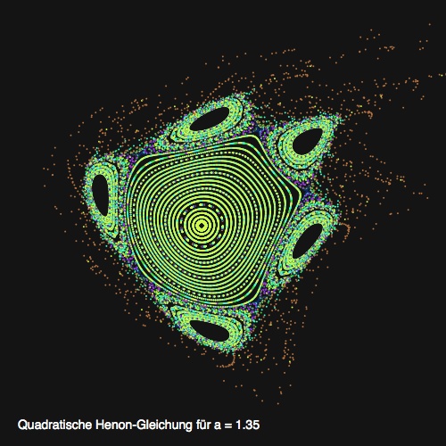
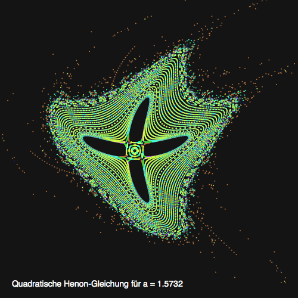

# Die quadratische Hénon-Gleichung

Die **quadratische Hénon-Gleichung** wurde vom französischen Astronomen und Mathematiker *[Michel Hénon](https://de.wikipedia.org/wiki/Michel_H%C3%A9non)* 1976 publiziert. Ihre Gleichung lautet:

$$
\begin{align}
x_{n+1} & = x_n cos(\alpha)-(y_n-x^2_n)sin(\alpha) \\\
y_{n+1} & = x_n sin(\alpha)+(y_n-x^2_n)cos(\alpha)
\end{align}
$$

Der Parameter $\alpha$ kann als Bogenmaß eines Winkels gedeutet werden; interessante Kurven erhält man durch Werte von $\alpha$ in der von $\frac{\pi}{2}$.

 

Die Bilder zeigen die quadratische Hénon-Gleichung für $\alpha = 1.35$ und für $\alpha = 1.5732$. Der Parameter $\alpha$ kann als Maß für die Störung des Systems gedeutet werden. Für $\alpha = 1.35$ sind die Störungen noch klein und betreffen nur die Randgebiete. Dagegen sind die Kreise für $\alpha = 1.3572$ zu einer $1:4$-Resonanz aufgebrochen.

## Der Quellcode

Ich habe die Visualisierung der quadratischen Hénon-Gleichung in Python mit der NodeBox programmiert. Der Quellcode ist eigentlich *straigthforward*: Fünfzig Mal werden die Kreise mit je leicht abgeändertem Startpunkt durchlaufen und dann wird die obige Formel einfach abgearbeitet. `p` und `q` werden so ausgerichtet und gestreckt, daß der Ursprung ungefähr in der Mitte liegt und die Abbildung die ganze Fläche ausfüllt.

~~~python
import math

size(500, 500)
colormode(RGB, range = 255)

# Konstanten
a = 1.5732
# a = 1.35
h = 0.02
max = 10.0e+9

x0 = 0.01
y0 = -0.02
cosa = math.cos(a)
sina = math.sin(a)

fill(20)
rect(0, 0, WIDTH, HEIGHT)
x = x0
y = y0
for j in range(50):
    for i in range(1500):
        if (x < max) and (y < max):
            x1 = x*cosa - (y - x*x)*sina
            y = x*sina + (y - x*x)*cosa
            x = x1
            p = (x + 1.25)*180
            q = (1.4 - y)*180
            if (i < 250):
                fill(183, 116, 64)
            elif (i < 500):
                fill(17, 42, 106)
            elif (i < 750):
                fill(159, 53, 233)
            elif (i < 1000):
                fill(57, 218, 56)
            elif (i < 1250):
                fill(67, 254, 211)
            else:
                fill(212, 251, 69)
            oval(p, q, 2, 2)
    x = x0 + j*h
    y = y0 + j*h

fill(255)
fontsize(14)
msg = "Quadratische Henon-Gleichung für a = {}".format(a)
text(msg, 20, WIDTH - 20)
~~~

Der Rest ist Kosmetik, die (Neon-) Farben haben keinerlei mathematische Bedeutung, sie sollen nur die Abbildungen etwas aufhübschen. Die Beschränkung auf ein `max` war notwendig, weil es zum Schluß der Iterationen doch Ausreißer gab, die selbst den Zahlenraum von Python sprengten und die Knotenschachtel in den Orkus schossen. Da die Knotenschachtel keine Punkte kennt, habe ich die einzelnen Punkte als kleine Kreise mit einem Durchmesser von zwei Pixeln gesetzt. Das gab ein optisch ansprechenderes Ergebnis, als Kreise mit einem Durchmesser von nur einem Pixel zu verwenden.

Auch heute ist ein Rechner mit solch einer Aufgabe ganz schön gefordert. Auf meinem betagten MacBook Pro dauerte es schon eine Weile, bis die Abbildung gezeichnet wurde. Auch auf meinem (deutlich) jüngeren und leistungsfähigeren Mac Pro mußte ich noch einige Sekunden warten, bis das Ergebnis vorlag. Aber ich finde, die Warterei hat sich gelohnt.