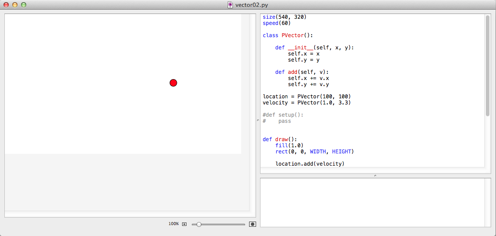
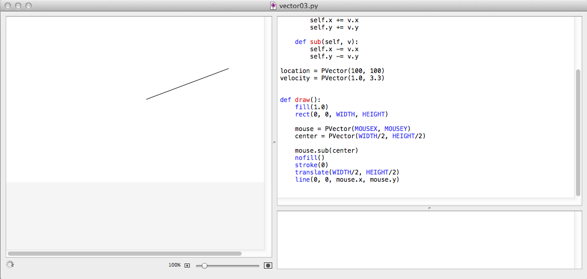
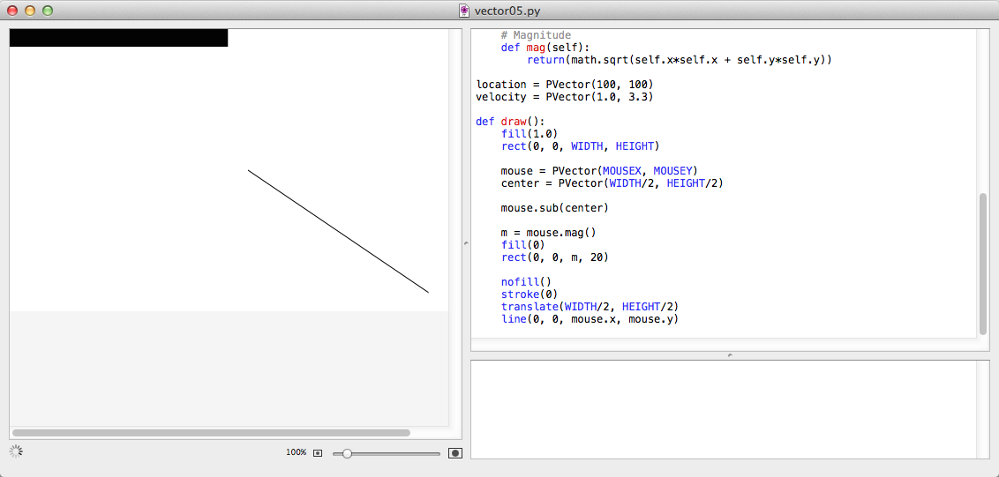

# Eine Vektor-Klasse für die Knotenschachtel

*»Roger, Roger. What's our vector, Victor?«*  
-- Captain Oveur (Airplane)

Mit diesem Tutorial möchte ich beginnen, die aus [Processing](http://cognitiones.kantel-chaos-team.de/programmierung/creativecoding/processing/processing.html) bekannte Klasse **[PVector](https://www.processing.org/reference/PVector.html)** in [NodeBox 1](http://cognitiones.kantel-chaos-team.de/programmierung/creativecoding/nodebox/nodebox.html) (und zwar in der Fork von *Karsten Wolf*) zu implementieren.[^vec11] Ich weiß, Karsten hat mit viel Mühe *numpy* in die Knotenschachtel eingebaut, aber das ist eher eine (riesige) Matrix-Bibliothek, die auch Vektoren kann. Für einfache Vektorrechnungen, wie sie bei simplen Animationen und Simulationen vorkommen, halte ich sie für *Overkill*.

[^vec11]: Processing kann nicht nur 2D, sondern auch 3D. Daher kann die Klasse PVector in Processing sowohl mit zweidimensionalen wie auch mit dreidimensionalen Vektoren umgehen. Da die NodeBox aber eher ein 2D-Programm ist, habe ich in meiner Implementierung der PVector-Klasse auf 3D verzichtet.

Und außerdem entstand der Wunsch nach dieser Klasse in mir, als ich *Daniel Shiffmans* Buch »[The Nature of Code][a1]« las. Beknntlich bin ich ein Fan von Shiffmans Video-Tutorials auf YouTube und möchte gerne einige seiner Beispiele (er programmiert entweder in Processing oder in [P5.js](http://cognitiones.kantel-chaos-team.de/programmierung/creativecoding/processing/p5js.html), einem JavaScript-Nachbau von Processing) mit der NodeBox nachprogrammieren und erweitern. In »Nature of Code« stellt Shiffman die Klasse PVektor ausführlich vor und die hier verwendeten Beispiele sind seiner Processing/Java-Implementierung nachempfunden.

[a1]: https://www.amazon.de/Nature-Code-Simulating-Natural-Processing/dp/0985930802/ref=as_li_ss_tl?ie=UTF8&qid=1516470353&sr=8-1&keywords=the+nature+of+code&linkCode=ll1&tag=derschockwell-21&linkId=05bf1f5c0829e75d9e45eb82d0c9ca11

## Start: Bouncing Ball ohne Vektoren

Als Ausgangspunkt habe ich erst einmal das klassische »Bouncing Ball«-Beispiel ganz ohne Vektoren in NodeBox implementiert. Der Quellcode dazu sieht so aus:

~~~python
size(540, 320)
speed(60)
x, y = 100, 100
xspeed = 1
yspeed = 3.3

def draw():
    global x, y, xspeed, yspeed
    fill(1.0)
    rect(0, 0, WIDTH, HEIGHT)
    
    x += xspeed
    y += yspeed
    
    # Check for bouncing
    if (x > WIDTH - 16) or (x < 0):
        xspeed *= -1
    if (y > HEIGHT -16) or (y < 0):
        yspeed *= -1
    
    stroke(0)
    fill(1.0, 0, 0)
    oval(x, y, 16, 16)
~~~

Das ist erst einmal nichts Besonderes. Ein kleiner Kreis wird auf die Reise geschickt und wenn er die Ränder des Canvas' erreicht, wird er reflektiert, damit er nicht auf Nimmerwiedersehen verschwindet.

## Bouncing Ball mit Vektoren

Ein Vektor ist ein mathematisches Objekt, das aus mehreren Komponenten besteht und das mit Seinesgleichen addiert und mit Skalaren multipliziert werden kann. Vektoren können unter anderem dazu benutzt werden, Punkte im Raum zu bezeichnen und diese Implementierung ist dazu gedacht, Vektoren (und Operationen darauf) zu schaffen, die im zweidimensionalen Raum operieren. Dazu muß erst einmal die Klasse `PVector` definiert werden. Im einfachsten Fall sieht sie so aus:

~~~python
class PVector():
    
    def __init__(self, x, y):
        self.x = x
        self.y = y
    
    def add(self, v):
        self.x += v.x
        self.y += v.y
~~~

Damit kann schon das obige Beispiel umgeschrieben werden:

~~~python
size(540, 320)
speed(60)

class PVector():
    
    def __init__(self, x, y):
        self.x = x
        self.y = y
    
    def add(self, v):
        self.x += v.x
        self.y += v.y

location = PVector(100, 100)
velocity = PVector(1.0, 3.3)

def draw():
    fill(1.0)
    rect(0, 0, WIDTH, HEIGHT)
    
    location.add(velocity)
    
    # Check for bouncing
    if (location.x > WIDTH - 16) or (location.x < 0):
        velocity.x *= -1
    if (location.y > HEIGHT -16) or (location.y < 0):
        velocity.y *= -1
    
    stroke(0)
    fill(1.0, 0, 0)
    oval(location.x, location.y, 16, 16)
~~~

Sieht man einmal von der Definition der Klasse `PVector` ab, ist das Progrämmcehn schon ein wenig kürzer als das Programm oben ohne Vektoren. Und vor allen Dingen entfällt die fehlerträchtige Definition globaler Variablen. Stattdessen werden zwei Vektoren verwendet, `location`, der die jeweiligen x- und y-Koordinaten des Objektes enthält und der Vektor `velocity`, der die Geschwindigkeiten für die x- und y-Richtung speichert. Der Clou ist nun die Zeile,

~~~python
location.add(velocity)
~~~

denn mit der Addition der Geschwindigkeit auf den Standort erhält man den neuen Standort des Objektes.

## Vektor-Subtraktion

Fast immer können mathematische Objekte, die addiert werden können, auch subtrahiert werden, so auch Vektoren. Man muß der Klasse `PVektor` nur um die Methode `sub()` ergänzen, die analog zu `add()` funktioniert:

~~~python
    def sub(self, v):
        self.x -= v.x
        self.y -= v.y
~~~

Mit der Vektor-Subtraktion kann die Differenz zwischen zwei Punkten im Raum festgestellt werden, zum Beispiel zwischen dem Zentrum des Canvas' und der aktuellen Mausposition. Diese kann man dann -- wie im Beispielprogramm -- mit einer Linie verbinden:

~~~python
size(540, 320)
speed(60)

class PVector():
    
    def __init__(self, x, y):
        self.x = x
        self.y = y
    
    def add(self, v):
        self.x += v.x
        self.y += v.y
        
    def sub(self, v):
        self.x -= v.x
        self.y -= v.y
        
location = PVector(100, 100)
velocity = PVector(1.0, 3.3)
     
def draw():
    fill(1.0)
    rect(0, 0, WIDTH, HEIGHT)
    
    mouse = PVector(MOUSEX, MOUSEY)
    center = PVector(WIDTH/2, HEIGHT/2)
    
    mouse.sub(center)
    nofill()
    stroke(0)
    translate(WIDTH/2, HEIGHT/2)
    line(0, 0, mouse.x, mouse.y)
~~~

Nun benutzt das Programm schon vier Vektoren, neben `location` und `velocty` auch je einen Vektor, der die aktuelle Maus-Position festhält und einen Vektor für das Zentrum des Fensters. Im Screenshot kann man leider nicht sehen, daß die Linie immer von der Mitte auf die aktuelle Mausposition zeigt, aber probiert es aus, dafür habe ich den Quellcode ja veröffentlicht.

## Vektor-Multiplikation und -Division

Multipliziert oder dividiert man einen Vektor mit einer Zahl, beeinflußt man damit die Länge des Vektors. Die beiden Methoden sehen so aus:

~~~python
    # Multiplikation mit einem Skalar
    def mult(self, n):
        self.x *= n
        self.y *= n
    
    # Division durch einen Skalar
    def div(self, n):
        self.x /= n
        self.y /= n
~~~

Im Beispielprogramm habe ich entweder den Vektor mit 0.5 multipliziert (auskommentierte Zeile) oder durch 2.0 geteilt, was beides den gleichen Effekt hat: Die Linie zeigt nur den halben Weg bis zur Mausposition.

~~~python
size(540, 320)
speed(60)

class PVector():
    
# -- snipp -- #
       
location = PVector(100, 100)
velocity = PVector(1.0, 3.3)
    
def draw():
    fill(1.0)
    rect(0, 0, WIDTH, HEIGHT)
    
    mouse = PVector(MOUSEX, MOUSEY)
    center = PVector(WIDTH/2, HEIGHT/2)
    
    mouse.sub(center)
    # mouse.mult(0.5)
    mouse.div(2.0)
    nofill()
    stroke(0)
    translate(WIDTH/2, HEIGHT/2)
    line(0, 0, mouse.x, mouse.y)
~~~

Ein weiterer Screenshot wäre langweilig (er unterscheidet sich nicht von dem letzten), daher habe ich darauf verzichtet.

## Magnitude: Die Länge eines Vektors

Mit Hilfe des Satzes des Pythogoras kann die Länge eines Vektors berechnet werden. Die zugehörige Methode sieht so aus:

~~~python
    def mag(self):
        return(math.sqrt(self.x*self.x + self.y*self.y))
~~~

Dafür darf man natürlich nicht vergessen, das Paket `math` zu Beginn des Programms zu importieren.

Im Beispielprogramm habe ich die Länge des Vektors dadurch visualisiert, daß in der oberen linken Ecke ein schwarzer Balken in der Länge des Vektors angezeigt wird:

~~~python
import math
size(540, 320)
speed(60)

class PVector():
    
# -- snipp -- #
       
location = PVector(100, 100)
velocity = PVector(1.0, 3.3)
    
def draw():
    fill(1.0)
    rect(0, 0, WIDTH, HEIGHT)
    
    mouse = PVector(MOUSEX, MOUSEY)
    center = PVector(WIDTH/2, HEIGHT/2)
    
    mouse.sub(center)
    
    m = mouse.mag()
    fill(0)
    rect(0, 0, m, 20)
    
    nofill()
    stroke(0)
    translate(WIDTH/2, HEIGHT/2)
    line(0, 0, mouse.x, mouse.y)
~~~

## Der Einheitsvektor

Die letzte der Grundoperationen auf Vektoren, die ich in diesem Tutorial vorstellen möchte, ist die Berechnung des *Einheitsvektors*. Der Einheitsvektor hat die Länge 1. Um ihn zu berechnen, muß man eigentlich nur einen bestehenden Vektor durch seine Länge teilen. Mann nennt diese Operation auch die *Normalisierung* eines Vektors. Allerdings sollte man den Fall abfangen, daß der Vektor die Länge Null besitzt (also ein *Nullvektor* ist), denn bekanntlich ist die Division durch Null verboten. Da die Transformation eines Nullvektors in einen Einheitsvektor auch keinen Sinn ergibt, habe ich das ganz pragmatisch gelöst,

~~~python
    def normalize(self):
        m = self.mag()
        if (m != 0):
            self.div(m)
~~~

in dem ich die Operation nur auf Vektoren zulasse, die keine Nullvektoren sind.

Nun zumSchluß noch ein letztes hier ein Beispielprogramm. Auch hier folgt der Vektor wieder dem Mauszeiger, behält aber immer die Länge von 150 Pixeln, da ich ihn erst normalisiert und dann mit 150 multipliziert habe. Außerdem habe ich die Vektorklasse in ein eigenes Modul (`pvector.py`) gepackt, das derzeit so aussieht:

~~~python
import math

class PVector():
    
    def __init__(self, x, y):
        self.x = x
        self.y = y
    
    def add(self, v):
        self.x += v.x
        self.y += v.y
        
    def sub(self, v):
        self.x -= v.x
        self.y -= v.y
    
    # Multiplikation mit einem Skalar
    def mult(self, n):
        self.x *= n
        self.y *= n
    
    # Division durch einen Skalar
    def div(self, n):
        self.x /= n
        self.y /= n
    
    # Magnitude
    def mag(self):
        return(math.sqrt(self.x*self.x + self.y*self.y))
    
    # Normalisierung
    def normalize(self):
        m = self.mag()
        if (m != 0):
            self.div(m)
~~~

Das Modul müßt ihr irgendwohin packen, wo es die Knotenschachtel auch findet, also am besten in das gleiche Verzeichnis wie Euer Programm oder in das Bibliotheksverzeichnis.

Das letzte Programm für heute sieht dann so aus:

~~~python
from pvector import PVector

size(540, 320)
speed(60)
        
location = PVector(100, 100)
velocity = PVector(1.0, 3.3)
    
def draw():
    fill(1.0)
    rect(0, 0, WIDTH, HEIGHT)
    
    mouse = PVector(MOUSEX, MOUSEY)
    center = PVector(WIDTH/2, HEIGHT/2)
    
    mouse.sub(center)
    
    mouse.normalize()
    mouse.mult(150)
    
    nofill()
    stroke(0)
    translate(WIDTH/2, HEIGHT/2)
    line(0, 0, mouse.x, mouse.y)
~~~

Ich wünsche Euch viel Spaß beim Nachprogrammieren und werde mich selber erst einmal weiter in *The Nature of Code* vertiefen, um dann in einem weiteren Tutorial die Klasse `PVector`zu erweitern. Es gibt nämlich noch so viele schöne und sinnvolle Vektoroperationen. [Dieser Artikel in der Wikipedia](https://de.wikipedia.org/wiki/Vektor) gibt einen ersten Überblick. *Still digging!*